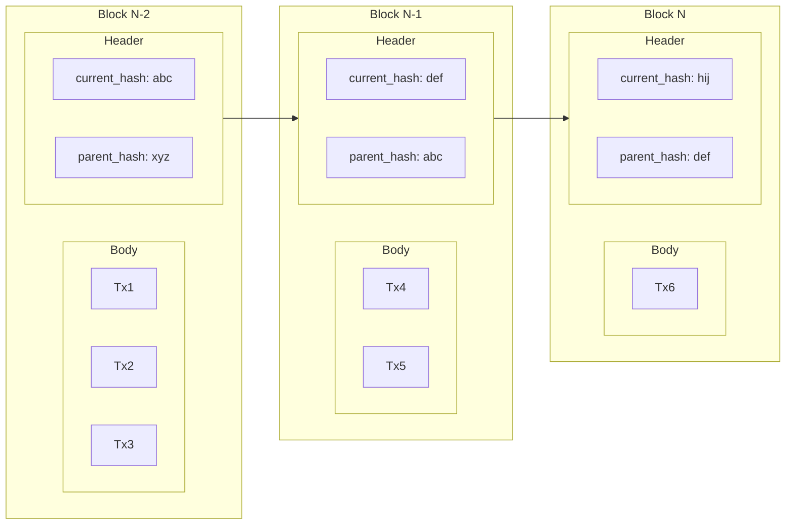

We have learned a fair bit about blockchains thus far. Moreover, we know by now that when we say _blockchain_, we actually mean a _network of nodes_ that are all interconnected and are utilizing various systems together to achieve what can ultimately be abstracted away as a [[Blockchain Models|(world) computer]] that is free of human-based trust and therefore [[Trustless]]. What were those properties again?

![[Trust#Science-based Trust]]

This chapter will then revise these three properties (and to some extent explain how blockchain systems achieve them) based on the new information that we have learned thus far. Finally, we will see what role the [data structure](https://en.wikipedia.org/wiki/Data_structure) known as a *blockchain* plays in this, which is surprisingly not very significant, ergo the cheeky name of this chapter.
## Recap of Blockchains Being [[Trustless]]
### Verifiable
- Blockchain systems ultimately have an [[STF]]. It declares *what* they are. In other words, what we should *expect them to do*. If the STF says this is a DEX, then it is a DEX. If the STF says it is a ponzi token, then it is a ponzi token. What blockchains achieve is **verifiable execution** of that said STF.
- This is achieved through the rules of the [[Consensus Algorithm]], incentivizing correct execution of STF and [[Slashing]] those who do otherwise[^3]. So, we have this [[TEE]]-like, magic global computer that will always execute its STF correctly no matter what.
- This correct execution of the STF can be verified by anyone monitoring the network.
- This gives us the **verifiability** that we named as the first two properties of science-based trust.
### Auditable History
- Suppose a blockchain has been launched a decade ago, similar to Ethereum around the time of writing.
- I can, using nothing more than a good internet connection, a large hard drive, and a few days of time, re-execute the entire history of Ethereum and ensure that Ethereum has indeed been executing its [[STF]] correctly in the last decade.
- While doing this, I can also know exactly in what order the previous transactions/blocks of Ethereum mutated its state to reach the current state.
- This gives us the **auditable history** and **correct ordering** property.
### Accessible
- Then, the above is not of much value if only a small group of people have access to the system, or a person can be banned arbitrarily. Ideally, anyone with Internet access can interact with a blockchain system on consumer hardware.
- Any limitation should be coded in a transparent way and not be arbitrarily changeable.
	- For example, if you don't have ETH tokens, you cannot interact with the Ethereum network. This is not a limitation on the accessibility, as it is a transparent rule of the system. In contrast, [OFAC sanctions](https://en.wikipedia.org/wiki/Office_of_Foreign_Assets_Control) suddenly ruling out some accounts as blacklisted is a less transparent exclusion of some users.
- This is why we argued in the previous chapter that a blockchain that is served to the entire world via one gigantic RPC server in the control of one company is NOT ACCESSIBLE, and therefore NOT [[Trustless]]. Or at least, not fully.
- Achieving accessibility in blockchains is ultimately a more fuzzy dimension, and it depends on how much effort a given blockchain network/company puts into it. One of the core pieces of technology, though, that we have learned about and which significantly enables accessibility is a blockchain's ability to have [[Blockchain Networks#Light Node|Light Nodes]][^4].

Now, with that out of the way, let's see what role a blockchain exactly plays in this.
## Blockchain's Role
The starting scenario to understand the exact role of a blockchain is as follows: Imagine we have a known correct order of five transactions in two previous blocks ($[tx_1, tx_2, tx_3]$ and $[tx_4, tx_5]$). How can a new participant append a $tx_6$ while preserving the order of all the previous transactions? A blockchain is an efficient means of solving this very problem.

A blockchain proposes to:
- Bundle all transactions that are being added, in the right order, into a single ***block** of transactions*
- Chain this new block to the previous one by putting a `parent_hash` field in its header, which points to the hash of the previous block.
- If all blocks do this, then the contents of all blocks are made immutable because the chain of `parent_hash`es always contains a commitment to all previous blocks, in that exact order.

Consider the following diagram, in which $block_{n-2}$ is known with its three transactions, and $block_{n-1}$ with two. $block_n$ is the new one that is meant to be added.

- Now let's walk backwards; $block_n$ is referencing `parent_hash: def` in its header, and `def` is used as an input to the final hash of $block_n$, which is `hij`.
	- This means, if anything in the header or body of $block_{n-1}$ changes:
	- Then the hash of $block_{n-1}$ is no longer `def`
	- And since `hij` contained `def` as its input, the `current_hash` of $block_n$ would be different.
- And notice that $block_{n-1}$ is doing the exact same thing!
- In essence, this creates a blockchain: an **immutable** and **append-only** linked list of blocks.
	- It is immutable because each block contains the hash of the previous block in it.
- This immutability chain extends all the way to the first block, with the same flow explained above.

In other words, the `hij` in the above diagram, the hash of the latest block, is essentially a [[Commitment Hash]] to all of the previous blocks and their exact content in a very efficient way, ensuring that any tampering with the previous blocks would be detected by breaking the chain of hashes.

Going back to the example at the beginning of [[#Blockchain's Role|this section]], what would we do if the blockchain data structure was not used? We could always re-hash all of the previous transactions as one large list to ensure their order is preserved when adding a new set of transactions. But obviously, this would not scale well.
## Overrated?
So, let's compare what part of [[#How Blockchains Are Trustless]] is in the domain of [[#Blockchain's Role]].
- A blockchain is NOT the technology that delivers **verifiable** execution, (in my opinion) the most magical property of blockchain systems. This is mainly achieved by the incentive mechanisms in the [[Consensus Algorithm]][^1].
- A blockchain is NOT the technology that makes the system **accessible**. This is achieved by leveraging [[Blockchain Networks#Light Node|light nodes]], [[State Proof]]s, avoiding large RPC providers becoming the dominant user gateway, and keeping the hardware requirements of participating in the network within a reasonable limit, among other considerations.

In contrast,
- The blockchain is part of the reason that we know the **correct ordering** of past events.
- Consequently, the blockchain is part of the reason we can **audit the past events** of the blockchain, by helping us know that these past events are correct.

> [!info] Summary
> A blockchain, as a data structure, is an **append-only list of transactions** with an easy way to ensure the history was not tampered with, mainly through chaining blocks of data together via the header's parent hash mechanism explained above.
## Summary: Means to an End
The true learning here is that **blockchains are a means to an end**. The goal is to create [[Trustless]] global computers and [[State Machine]]s, capable of performing computation with properties of science-based trust, not being at the mercy of human-based trust to uphold their promise of "not being evil," but rather us being able to verify it.

Blockchain, as a data structure, *contributes* to this goal by giving us a system that allows the history to be recorded and audited in an efficient way; that's all.

> [!tip]- Sneak peek
> In [[The Bigger Picture]], we take this a step further and explain how building these [[State Machine]]s that can do computation [[Trustless]]ly is also part of the bigger picture and is not the only technology that we need for it.

[^1]: or as we will learn much later, via [[Scaling Out - SNARKs]].
[^3]: See [[Proof of Work and Proof of Stake]] for a bit more detailed explanation of how this is achieved. In short, it boils down to [[Economic Security]].
[^4]: Depending on the design and implementation choices, some blockchains will have a much harder time having light nodes than others. See "Using fast state commitments" [here](https://arxiv.org/html/2508.10493v1#bib.bib10) for an explanation of why implementation of native light nodes in Solana is challenging, if not impossible.
