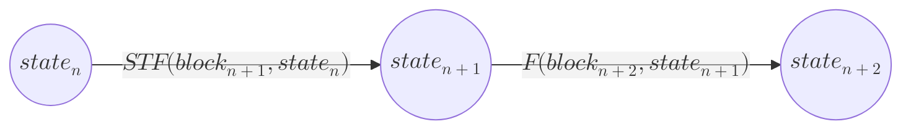
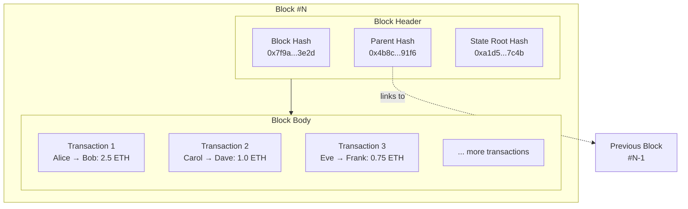

So much has been said about how to [[Blockchain Models|model]] blockchains in abstract terms in [[Execution, Ordering and History]], and what properties they have. But it is finally time to define a few concrete keywords about blockchains. Establishing these keywords now will also make reading the next chapters smoother, as a reader would have concrete terms to refer to something (e.g., a block, transaction, or header).
## Blockchain Systems != Blockchains
First, let's establish that, unfortunately, we live in a world where names are often mistakenly attributed to broader terms. In consumer products, this is called [genericized trademarks](https://en.wikipedia.org/wiki/List_of_generic_and_genericized_trademarks) (like Xerox and Kleenex), and what we see here is the technological equivalent of that.

We refer to a very broad system, composed of many technologies, as a blockchain, even though a blockchain is merely a data structure used in a little corner of it, and it is not even a fundamental one. More on this in [[Blockchains Are Overrated]].

So, going forward, when the word blockchain is used, we often mean a broad system that utilizes a blockchain.

## Blockchain Terminology
Recall a blockchain's main ultimate purpose is to store some **([[Blockchain and Contention|contentious]]) [[State]]**, and it is updated in what is known as a [[State Transition Function]] or [[STF]]. The event that causes the STF to be executed is the creation of a new [[Block]]. So, the block is the input to the STF.

$$
\begin{aligned}
STF(block_{n+1}, state_n) \rightarrow state_{n+1}
\end{aligned}
$$
or:

A [[Block]] is composed of a [[Block Header]], and a set of instructions. In most cases, these instructions come from external users and are called [[Transaction]]s. The block header contains a few key pieces of information, most notably:
- A number ($N$, $N-1$, ..) indicating the number for this block. This is called the **block height**, and should only ever increment by 1.
- A [[Commitment Hash]] (in the form of a [[Merkle Tree]]) of the blockchain state after executing a block and its transactions. This is called the [[State Root]].
- The hash of the parent block on top of which this block is meant to be considered valid.
- The hash of the current block, so that the next potential block can link back to it.
- These hashes, combined together, ensure some of the [[Trustless]] properties of blockchains.

More about the blockchain [[State]]. The state of the blockchain is only ever meaningful *when linked to a specific block*. This is because a blockchain system essentially has *two types of states*:
- The [[Genesis]] state, which needs to be hardcoded and agreed upon by everyone.
- All the rest.
The reason we emphasize this is that the rest of the states, say at block $b$, can always be re-computed by executing the sequence of blocks from $0$ to $b-1$. Revisit [[Execution, Ordering and History#Genesis and Syncing]] for a refresher if need be.
### Node Software and Clients
Finally, although we have not yet zoomed out and looked at the entities that run a blockchain in a network (this comes in the next chapter, [[Blockchain Networks]]), for now, assume that to _run a blockchain_, one typically has to run software that is called a _[[Blockchain Node]]_ or _client_ in a network of nodes.

What we can re-emphasize here is a few key actions that each node does and what data they store. This information will be supplemented further in the next chapter, [[Blockchain Networks]].
- Most importantly, for all the reasons mentioned above, **most nodes opt to store the entire history of all past blocks**, as it is the most straightforward way for them to (re)verify the entire history of the blockchain, one of the key pillars of being [[Trustless]].
- Each node typically stores the [[State]] associated with a number of recent blocks, and at times, all of them. **Recall that storing old states is entirely optional**. Any old state can always be reconstructed when needed (although it can be time-consuming, therefore some nodes opt to store all previous states).
- The node software runs the [[State Transition Function]] upon accepting new blocks, or when it authors new blocks.

## Summary
This chapter was mainly about terminology and making the reader familiar with blockchain lingo, such as [[Block]], [[Block Header]], and [[Transaction]].

We also briefly explained what each node in a network does, which we further explain in the next chapter, [[Blockchain Networks]].
