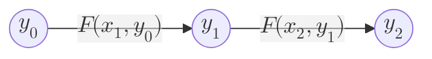

All of the chapters so far have given us a solid foundation to understand *what* blockchain systems can do, and to a limited extent, *how* they do it. In the remaining closing chapters of part 1, we will zoom back and evaluate the bigger picture.
- First, in this chapter, we will (re-)iterate what properties the system that we have so far described have.
- In the next chapter, [[The Bigger Picture]], we will discuss what other technologies are necessary to exist alongside a blockchain to deliver a useful system to the people of the world that actually helps them live a life with less [[Trust#Human-based Trust|human-based trust]] and more [[Trust#Science-based Trust|science-based trust]].
## [[Trustless]] Computation and Storage
The most high-signal way to summarize the first important property of blockchain systems is to recall that they provide two important digital primitives:
- **Computation**, in the form of execution of [[STF]] as a consequence of a new [[Block]] being imported, containing different [[Transaction]]s from users.
- **Storage**, in the form of [[State]] updates, as a consequence of execution of the STF.

And keeping in mind that this computation, and its consequent storage updates, assuming the blockchain is implemented properly, adhere to all three properties of a [[Trustless]] system:
- Verifiable: The computation happens correctly and its state changes are correct.
- Auditable History: The entire history of all computations that have happened can be audited, and the intermediate states after each step can be reconstructed.
- Accessible: Access to this computation and storage is open to anyone adhering to the rules of the system, such as the ability to pay gas fees.
## Expensive
Providing [[Trustless]] computation and storage is no easy feat, and therefore it is also not particularly cheap. While the exact numbers vary from blockchain to blockchain, executing a program in a normal computer is probably at least thousands of times cheaper (if not millions) than running it [[Trustless]]ly in a blockchain system.

This expensiveness can be expressed in at least two ways:
- **Cost**. The computation and its corresponding storage literally cost money. For example, storing a gigabyte of storage in a normal cloud is practically free, while storing a gigabyte of data in Ethereum will cost a lot more.
- **Speed**. The computation and its corresponding storage updates are slower to perform. To do any computation on a blockchain, even assuming we have infinite money to cover the cost, we are limited by a few more factors:
	- How often the blockchain produces new [[Block]]s (the [[Block Time]]).
	- What is the maximum computation/storage that can be fit in a single block. Almost all blockchains impose maximum resource consumption limits per-block. In the language of smart-contract chains, a maximum [[Gas]] that can be consumed by the entire block.
## [[Blockchain and Contention|Contentious]]
The above will hopefully fully convey the point that a blockchain system is not well-fitted for arbitrary computation and storage, but rather for those that bear enough importance or value that would justify the expensiveness (such as, of course, financial applications, ergo [[DeFi]]). This importance can be among the following, but not limited solely to these as new use cases beyond my imagination might come up:
- **Social** interactions that two parties that don't trust one another want to transact.
- **Value-bearing** interactions such as DeFi.
- **Sensitive** applications where the accessibility of a [[Trustless]] system is desired, such as whistleblowing. Imagine use cases where it is desirable to know that once data or a [[Smart Contract]] is published, it cannot be taken down by any single individual or authority.
## Public
Recall from [[Blockchain Networks]] that blockchains achieve most[^1] of their [[Trustless]] properties by having the [[Validator]]s of the network re-check the work of one another. This entails that everything that the blockchain does is **public by default**, or else other validators cannot re-check anything.

We emphasize "by default" because there are techniques to make this partially or fully private, but this involves cryptography primitives (see [[Moon Math - ZKP, FHE and MPC]]) and it is not the norm. As of today, almost all major blockchains operate fully in public, where every transaction and its details can be seen by anyone. Specific smart contracts attempt to provide privacy to users[^3], and a handful of blockchains are designed from the ground up to be private[^4].

> [!warn]- Block Explorers
> This is why every blockchain has a notion of _Block Explorer_, a public dashboard where every block and every transaction and every account's activity is indexed. None of your banks have a public explorer where you can see the money that your neighbor spent.

The main remedy to this in public blockchains, so far, has been using pseudonymous accounts. In that a user's identity is not mandatorily linked to an account ID that the blockchain recognizes[^2]. If care is taken, it is possible to keep an account ID anonymous. So, even though anyone can see *what* an account does, they cannot easily know *who* it is. Yet, with limited [[On and Off Ramp]] options, it is almost always the case that the centralized exchanges can link an identity to an account ID.

> It is often said that having no privacy is the "original sin" of Bitcoin.
## Digital
This point has been well emphasized as early as [[Blockchain-based Authorities#Oracle Problem|the second chapter]], but perhaps it is easier to re-iterate it here: the full [[Trustless]] spectrum of blockchains can be best materialized if the [[State]] on top of which the blockchain is coming to consensus is fully digital, and has no dependency on an [[Oracle Problem|oracle]] to bridge real-world information to the blockchain. This is not to say that no such endeavor should be attempted, but it is something important to be aware of.
## Ownerless
One of the properties of [[Trust#Science-based Trust|science-based trust]] is that they require much less support to operate. When you forget your Gmail password, you can contact Google and ask them to recover it for you, because at the end of the day they are the gatekeepers. If you lose your digital private key used in Ethereum, unfortunately there is no one to contact.

This is a double-edged sword; [[Trustless]] systems have fewer (if any) humans to control them. It makes them more resilient to corruption, but it also gives them this sense of being "ownerless".

Almost all blockchain companies, at least on the surface, hold the claim that they have little to no control over the protocol that they have built, and it is deployed and will survive on its own forever. Any upgrades, or fixes, are coordinated by various means of decentralized [[Governance]].

This is somewhat of a pain point for the adoption of [[Web3]] technologies. Unsurprisingly, no one feels comfortable doing business knowing there is no support hotline to fix issues if something goes wrong. Needless to say, many blockchain protocols have some form of support baked into them, either as a supporting company or foundation, or the governance system having promises.

But, at the end of the day, it is a new paradigm, and we have to change our perspectives to trust the system rather than the supporting humans behind it.
## Summary
Blockchains provide [[Trustless]] computation and storage primitives to developers to build applications that inherit those properties.

As of now, blockchains do this in public, but this is not a fundamental limitation and with further performance improvements in the [[Moon Math - ZKP, FHE and MPC]] group of technologies, they could operate with much more privacy.

They suffer from a high cost and slow speed to achieve the Trustless properties. At first sight, it is clear that use cases that are social, [[Blockchain and Contention|contentious]] and digital are best fitted to be implemented by blockchains.

[^1]: To be precise, 2 out of 3, the verifiability and auditability.
[^2]: Some chains allow you to optionally link an identity to your account ID, such as the ENS system in Ethereum.
[^3]: RAILGUN, Tornado Cash, Aztec, ZAMA Stack
[^4]: Monero, ZCash
